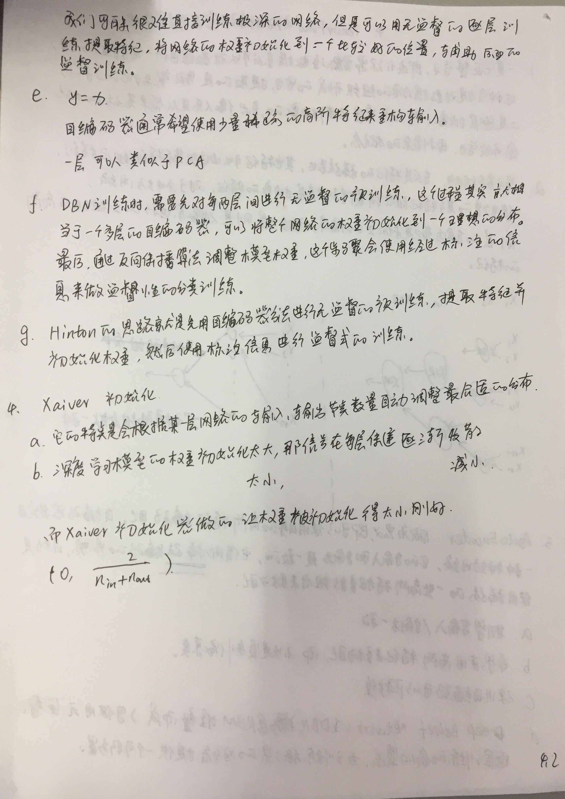

## what autoencoder

* 一种利用隐变量表示输入的表示学习方法。其中隐变量是需要学习。

* 自编码器是神经网络的一种，经过训练后能尝试将输入复制到输出。自编码器内部有一个隐藏层h，可以产生编码表示输入。
* 我们不应该将自编码器设计成输入到输出完全相等。这通常需要向自编码强加一下约束，使它只能近似复制，
并只能复制与训练数据相似的输入。这些约束强制模型考虑输入数据的哪些部分需要被优先复制，因此它往往能学习到数据的有用特性。
