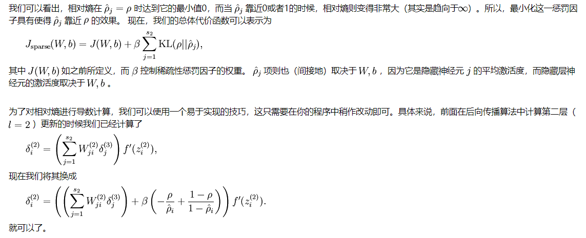
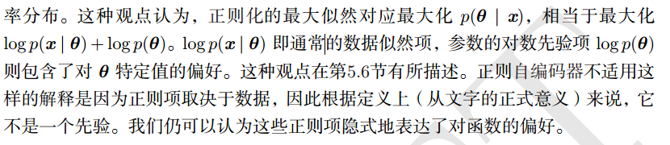
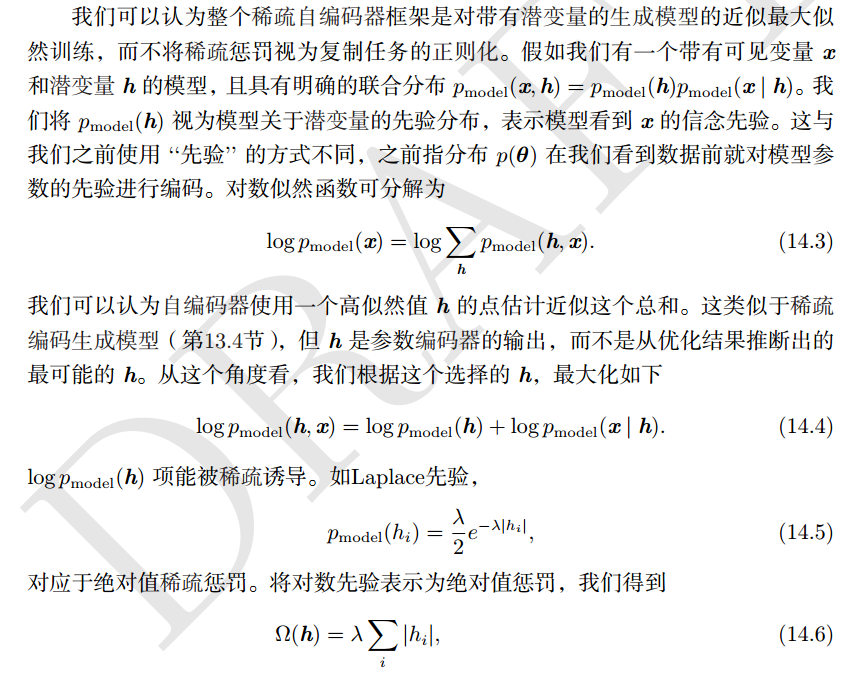
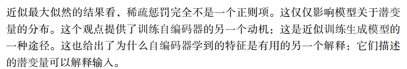

#### 2.1 稀疏自编码器

* 稀疏自编码器简单地在训练时结合编码层的稀疏惩罚 Ω(h) 和重构误差：L(x,g(f(x))) + Ω(h)，
* 稀疏自编码器一般用来学习特征，以便用于像分类这样的任务。稀疏正则化的自编码器必须反映训练数据集的独特统计特征，
而不是简单地充当恒等函数。以这种方式训练，执行附带稀疏惩罚的复制任务可以得到能学习有用特征的模型。

* [ufldl 自编码算法与稀疏性](http://deeplearning.stanford.edu/wiki/index.php/%E8%87%AA%E7%BC%96%E7%A0%81%E7%AE%97%E6%B3%95%E4%B8%8E%E7%A8%80%E7%96%8F%E6%80%A7)
