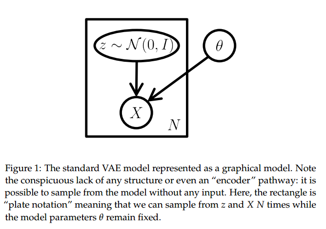

* [paper第上面文章的解读](paper/24.901-2016-Tutorial-on-Variational-Autoencoders.pdf)


### 摘要

* VAE利用神经网络建立，并可以通过随机梯度下降训练。
* VAE可以生成很多种类的数据.
* 本文介绍AVE背后的数学，描述实验表现。


###  1 Introduction   

* “生成建模”是机器学习的一个广泛领域，它涉及在一些潜在的高维空间X中定义在数据点X上的分布P（X）的模型。例如生成图片。
* 如果我们能够到数据的分布，我们就可以造成更多的数据。
    * 之前的方法都需要假设数据的分布，这是个大问题
    * AVE解决这个问题

#### 1.1 Preliminaries: Latent Variable Models

* 在训练生成模型时，维度之间的依赖关系越复杂，模型越难训练。
* 在我们的模型绘制任何东西之前，它首先从集合`[0，...，9]`中随机抽样一个数字值z，然后确保所有笔划都匹配那个字符。 
z被称为'潜在'，因为只给出模型产生的字符，我们不一定知道潜在变量的哪些设置产生了字符。我们需要用像计算机视觉这样的东西来推断它。
* 当我们的模型为每个数据找到了潜变量的时候，我们的模型就学好了。 z（学到的分布） * θ（学到的参数） = x（数据集）




### 2 Variational Autoencoders


#### AVE需要处理两个问题

* 隐变量z如何表示？
    * 使用标准正态分布，因为只要有一个n维标准正态分布的z，再找到一个足够复杂的函数g，那么g(z)就可以表示任意一个n维分布。
    * 他们假设对z的维度没有简单的表达，而是断言z的样本可以从简单的分布中得出，即N（0，I），其中I是单位矩阵。
    * 我们希望避免手工决定z的每个维度编码的信息、
    * 通过足够复杂的函数，d为的两个任意分布之间可以转换。

* 以及如何处理z上的积分


### 2.1 Setting up the objective 设定目标

* 这意味着我们需要一个新的函数Q（z | X），它可以取X的值，并给出一个可能产生X的z值的分布。
* 希望在Q下可能的z值的空间将比在先前的P（z）下可能的所有z的空间小得多。 这让我们比较容易计算Ez〜QP（X | z）。 

* 这里KL散度使用的公式：


* Q : 将x编码为z； P： 用z重构x

#### 2.2 Optimizing the objective 优化目标

* Q(z|X) = N(z|µ(X; ϑ), Σ(X; ϑ)), θ可以从数据集学习。


* L2 norm or mse 作为重构损失是因为假设了似然分布是 normal. 
log概率 c*exp(k*(x-x*)^2) (高斯) x是重构，x*是标签. log 似然 c + k(x-x*)^2 ~ (x-x*)^2 这就是MSE损失的由来.
如果我们假设x是 Bernoulli distribution这样就获得解码损失为交叉熵。

* [Introducing Variational Autoencoders (in Prose and Code)](http://blog.fastforwardlabs.com/2016/08/12/introducing-variational-autoencoders-in-prose-and.html)

* [Under the Hood of the Variational Autoencoder](http://blog.fastforwardlabs.com/2016/08/22/under-the-hood-of-the-variational-autoencoder-in.html)
    * 变分自编码采用KL散度的方式，使得分布近似正太分布，使用KL散度度量两个分布。
    * 因为KL散度不对称 — DKL(q||p)≠DKL(p||q)— 所以对于生成模型， 它不是一个正确的度量。


    
        
* loss定义
```
# 重构loss： 网络重构图片的能力
generation_loss = mean(square(generated_image - real_image))  
# a latent loss： KL散度度量下隐变量和单位高斯分布的接近程度
latent_loss = KL-Divergence(latent_variable, unit_gaussian)  
# 两个损失的折中
loss = generation_loss + latent_loss 
```
* 计算KL散度技巧：  为了优化KL散度, 代替编码生成实值向量，它将生成 means 向量和 standard deviations 向量。


> 思路是, 从 N（u, sd）采样和从 N(0, 1)采用数据 然后 (data * sd + u)运算得到数据是一样的。
现在编码器的重构损失和KL散度可以一起训练,重构损失将约束编码器输出单位高斯值。
* 采样操作对和不可导， 无法使用反向传播。
* 所以最终，VAE的优化目标就是，让最终的输出与目标足够接近的同时，隐变量的分布接近真实先验分布。


## 实验

### 使用交叉熵定义重构损失
* 隐变量个数
    * 20： 正常训练
    * 2： nan两个损失都走向了nan
    
### 使用 MSE 作为重构损失
* 隐变量个数： 
    * 2：能够学到东西，损失很大，
    * 20：


