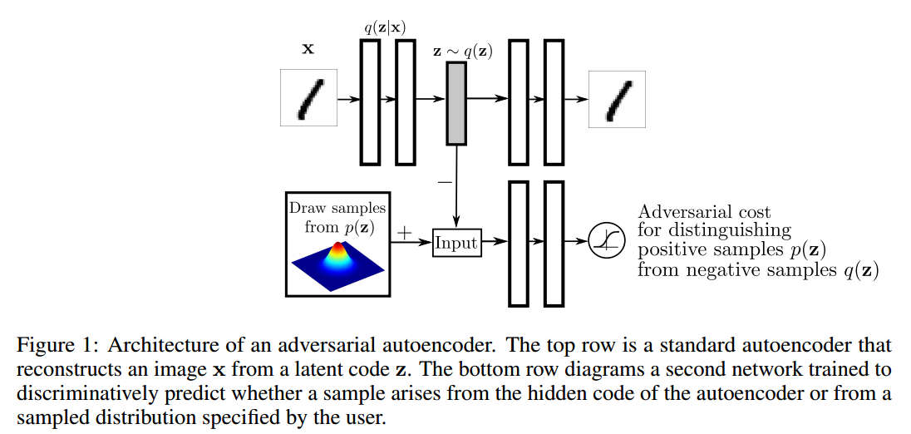
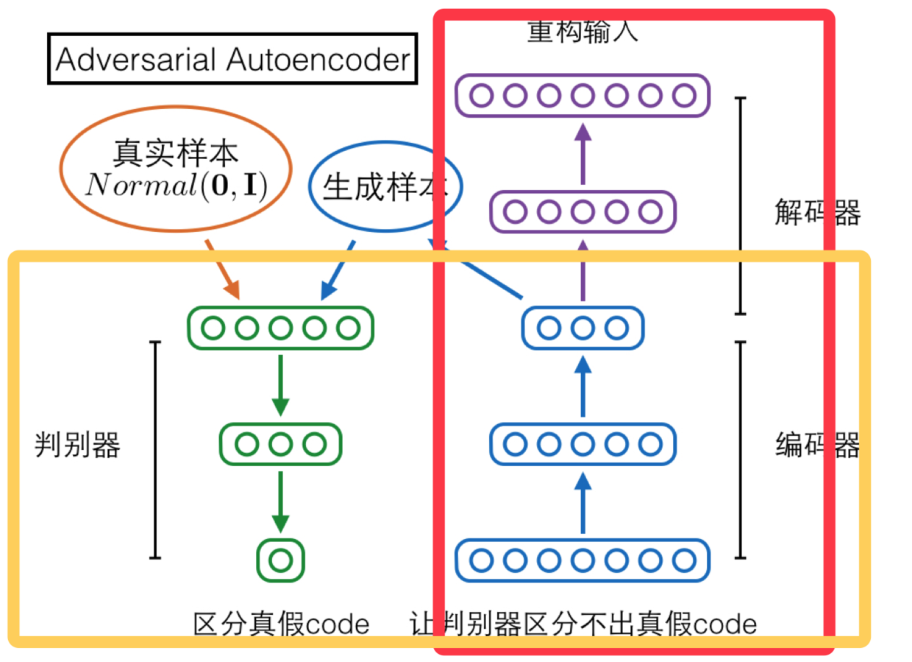
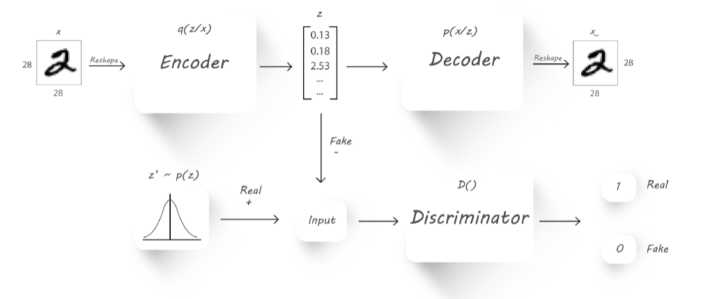

* 上半部分就是AE，我们都知道AE需要把一个真实分布映射成隐层的z，AAE就是在z这里动手脚，在此加上对抗思想来优化这个z.

* 对抗自编码是一个自编码网络正则化来匹配后验分布q(z), 和任意分布 p(z).
* AAE就是一种让 q(z)去匹配p(z)的AE

## reference

* [A wizard’s guide to Adversarial Autoencoders: Part 1, Autoencoder?](https://towardsdatascience.com/a-wizards-guide-to-adversarial-autoencoders-part-1-autoencoder-d9a5f8795af4)
    * 现在随便把一个数字输入编码，发现解码的数字很模糊, 这是因为隐变量无法覆盖所有2维空间(和真实分布之间还有差距).
    所以如果你输入一张训练没有训练到的图片, 我们就会看到奇怪的输出图像. 这可以通过约束编码的输出来获得随机的分布 
    (比如 0.0 mean and a standard deviation =2.0) 当产生隐变量的时候. 这就是对抗自编码的能力.
    
    * 自编码的指导分布是随机分布， 这会使正的越来越大，负的越来越小，中间会有一个大的间隔，如果我们输入一个落在间隔中的
    数据，输出就会变得模糊。
    * 自编码，提供了相似图像的隐变量，这些编码在欧几里得空间中彼此远离。 
    这可能会导致所有2被映射到不同区域。 我们希望相似图片有相近编码来获得有意义的表示。 
    * 后面变分自编码让分布比较正态分布，AAE也是让分布加个约束。
    
* [A wizard’s guide to Adversarial Autoencoders: Part 2, Exploring latent space with Adversarial Autoencoders.](https://towardsdatascience.com/a-wizards-guide-to-adversarial-autoencoders-part-2-exploring-latent-space-with-adversarial-2d53a6f8a4f9)
* [Adversarial Autoencoders](https://hjweide.github.io/adversarial-autoencoders)
    * 
