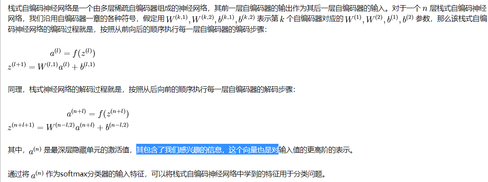

### 栈式自编码

* 逐层贪婪训练法依次训练网络的每一层，进而预训练整个深度神经网络。
可以将自编码器“栈化”到逐层贪婪训练法中，从而预训练（或者说初始化）深度神经网络的权重。
* 栈式自编码神经网络是一个由多层稀疏自编码器组成的神经网络，其前一层自编码器的输出作为其后一层自编码器的输入。

* 栈式自编码神经网络具有强大的表达能力及深度神经网络的所有优点。
* 它通常能够获取到输入的“层次型分组”或者“部分-整体分解”结构。
* 栈式自编码神经网络的第一层会学习得到原始输入的一阶特征（比如图片里的边缘），
第二层会学习得到二阶特征，该特征对应一阶特征里包含的一些模式（比如在构成轮廓或者角点时，什么样的边缘会共现）。
栈式自编码神经网络的更高层还会学到更高阶的特征。

