# 总结各种自编码网络

## 第一个自编码: 降噪自编码

* [code](AE_single_layer.py)

* 自编码作为一种无监督学习方法，它与其他无监督学习主要不同在于，它不是对数据进行聚类，而是提取其中最有用，
最频繁出现的高阶特征，根据这些高阶特征重构数据。

## what autoencoder

* 一种利用隐变量表示输入的表示学习方法。其中隐变量是需要学习。

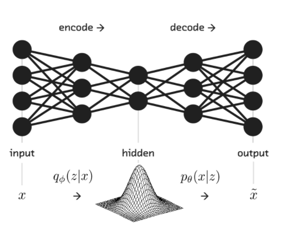

* 自编码器是神经网络的一种，经过训练后能尝试将输入复制到输出。自编码器内部有一个隐藏层h，可以产生编码表示输入。
* 我们不应该将自编码器设计成输入到输出完全相等。这通常需要向自编码强加一下约束，使它只能近似复制，
并只能复制与训练数据相似的输入。这些约束强制模型考虑输入数据的哪些部分需要被优先复制，因此它往往能学习到数据的有用特性。

### 特点

* 自动编码器是数据相关的，这意味着自动编码器只能压缩那些与训练数据类似的数据。
比如，使用人脸训练出来的自动编码器在压缩别的图片，比如树木时性能很差，因为它学习到的特征是与人脸相关的。
* 自动编码器是有损的，意思是解压缩的输出与原来的输入相比是退化的，MP3，JPEG等压缩算法也是如此。这与无损压缩算法不同。
* 自动编码器是从数据样本中自动学习的，这意味着很容易对指定类的输入训练出一种特定的编码器，而不需要完成任何新工作。
* 自编码器是一个自监督的算法，并不是一个无监督算法。自监督学习是监督学习的一个实例，其标签产生自输入数据。
要获得一个自监督的模型，你需要一个靠谱的目标跟一个损失函数，仅仅把目标设定为重构输入可能不是正确的选项。
基本上，要求模型在像素级上精确重构输入不是机器学习的兴趣所在，学习到高级的抽象特征才是。
事实上，当主要任务是分类、定位之类的任务时，那些对这类任务而言的最好的特征基本上都是重构输入时的最差的那种特征。
* 对于自编码器，我们往往并不关系输出是啥，我们真正关心的是中间层的编码，在我们强迫编码y和输入x不同的情况下，
系统还能够去复原原始信号x，那么说明编码y已经承载了原始数据的所有信息，但以一种不同的形式！
这就是特征提取，而且是自动学出来。实际上，自动学习原始数据的特征表达也是神经网络和深度学习的核心目的之一。

## why autoencoder

* 高维数据对于我们的感官体验总是不友好，如果我们将输入降低至二维，放在二维平面中就会更加直观
* 这些好处来源于对数据的丰富理解仅仅是冰山一角, 观察到的潜在因果概率过程才是最终结果。
* 核心思想： What I cannot create, I do not understand

## how 

* encode和decode两个过程可以理解成互为反函数，在encode过程不断降维，在decode过程提高维度。
* 当AutoEncoder过程中用卷积操作提取特征，相当于encode过程为一个深度卷积神经网络，好多层的卷积池化，
那么decode过程就需要进行反卷积和反池化

## which 

### 1. 欠完备自编码器

* 从自编码器获得有用特征一种方法是限制h的维度比x小，这种编码维度小输入维度的自编码器成为欠完备自编码器。
* 学习欠完备的表示将强制自编码器捕捉训练数据中的限制特征。
* 学习出PCA相同的生成子空间。

 
### 2. 正则自编码器

* 编码维数小于输入维数的欠完备自编码器可以学习数据分布最显著的特征。如果赋予这类自编码器过大的容量，它就不能学到任何有用的
信息。
* 根据要建模的数据分布的复杂性，选择合适的编码维数和编码器解码器容量，就可以成功训练任何架构下的自编码器，正则自编码器
提供这样的能力。
* 正则自编码器使用的损失函数可以鼓励模型学习其他特性，而不不必限制容量，
    * 稀疏性表示、表示的小导数以及对噪声或输入缺失的鲁棒性。
* 几乎带有任何潜变量并配有一个推断过程的生成模型，都可以看做自编码器的一种特殊形式。
* 强调与自编码器联系的两个生成式建模方法是：Helmholtz机的衍生模型，
    * 变分子编码
    * 生成随机网络
    * 这种衍生自编码模型学习出高容量且过完备的模型，进而发现输入数据中有用的结构信息，并且无需对模型进行正则化。

#### 2.1 稀疏自编码器

* 稀疏自编码器简单地在训练时结合编码层的稀疏惩罚 Ω(h) 和重构误差：L(x,g(f(x))) + Ω(h)，
* 稀疏自编码器一般用来学习特征，以便用于像分类这样的任务。稀疏正则化的自编码器必须反映训练数据集的独特统计特征，
而不是简单地充当恒等函数。以这种方式训练，执行附带稀疏惩罚的复制任务可以得到能学习有用特征的模型。

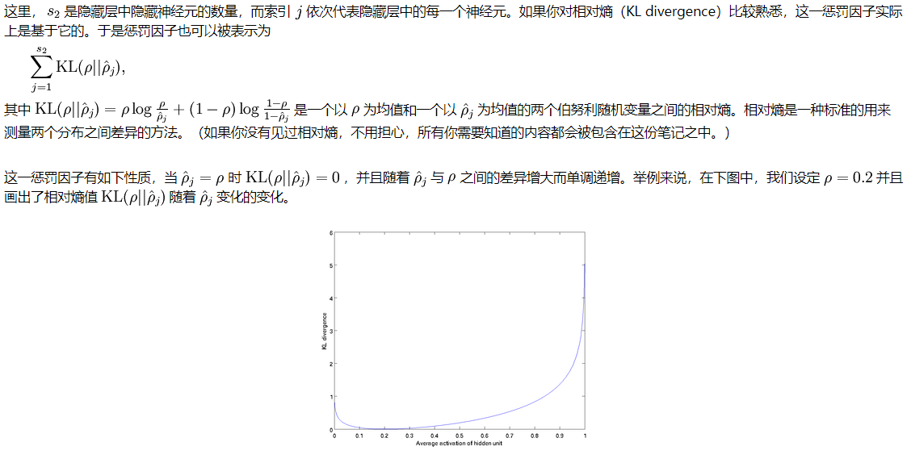

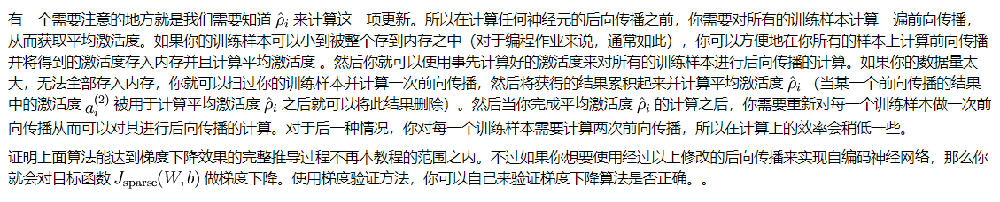

* [ufldl 自编码算法与稀疏性](http://deeplearning.stanford.edu/wiki/index.php/%E8%87%AA%E7%BC%96%E7%A0%81%E7%AE%97%E6%B3%95%E4%B8%8E%E7%A8%80%E7%96%8F%E6%80%A7)

#### 2.2 去噪自编码器

* 去噪自编码器, 最小化L(x,g(f(˜ x)))，其中 ˜ x 是被某种噪声损坏的 x 的副本。因此去噪自编码器必须撤消这些损坏，而不是简单地复制输入。
* 对于AutoEncoder，每一次的训练都是自身的对比，这会造成输出和输入越来越类似，而对同种类的其他图片表现不敏感，
于是，De-noising AutoEncoder派上了用场，在输入之前，先将图片加入随机噪声，这样每次的输入都会略有差异，
然后将带有噪声的图片进行AutoEncoder，将输出的y与加噪声之前的图片进行比较，这样训练出来的y就具有抗噪声的能力，
在以图搜图的场景下也就提高了泛化能力。
* Behind this mask is a man, and behind this man is an idea, and ideas are bulletproof。

* DAE的训练准则（条件高斯 p(x | h)）能让自编码器学到能估计数据分布得分的向量场 (g(f(x)) − x) ，这是DAE的一个重要特性。
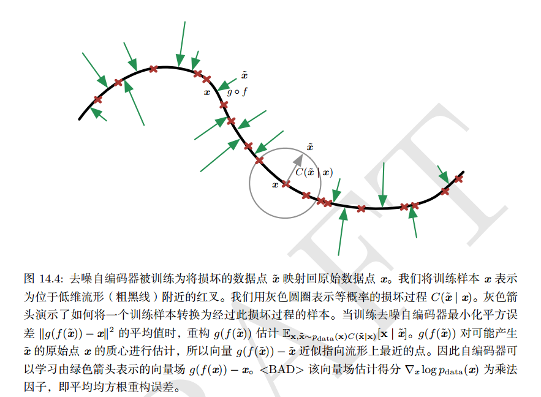

#### 2.3 收缩自编码器

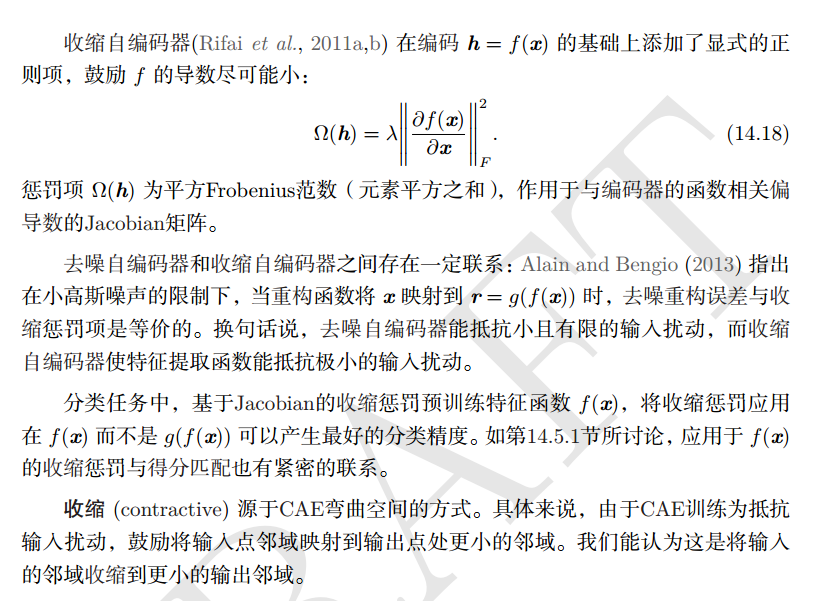
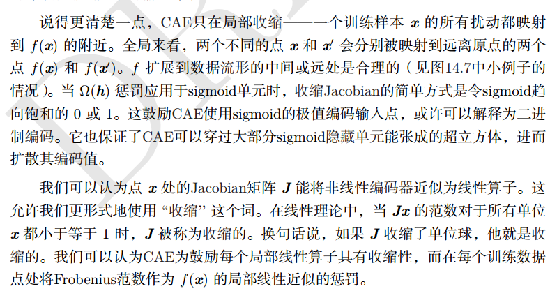

* 这迫使模型学习一个在 x 变化小时目标也没有太大变化的函数。
因为这个惩罚只对训练数据适用，它迫使自编码器学习可以反映训练数据分布信息的特征。
这样正则化的自编码器被称为收缩自编码器（contractive autoencoder, CAE）。
这种方法与去噪自编码器、流形学习和概率模型存在一定理论联系。

#### 2.4 变分自编码

* [VAE.md](VAE.md)

#### 2.5 对抗自编码
* [AAE.md](AAE.md)

### 3.随机编码器和解码器

## where 

* 目前自编码器的应用主要有两个方面，
    * 传统的自编码器被用于降维和特征学习
    * 自编码器与隐变量模型理论的联系将自编码器带到了生成式建模的前沿。

* 关于预训练与深度学习
    * Stacks of unsupervised feature learning layers are STILL useful when you are in a regime with insufficient labeled examples, 
    for transfer learning or domain adaptation. It is a regularizer.  But when the number of labeled examples becomes large enough,
    the advantage of that regularizer becomes much less.I suspect however that this story is far from ended!
    There are other ways besides pre-training of combining supervised and unsupervised learning, 
    and I believe that we still have a lot to improve in terms of our unsupervised learning algorithms. 

* 语义hash，降维可以使用信息检索更快。
* And recently where Autoencoders trained in an adversarial manner could be used as generative models
    
### 自编码器学习流形

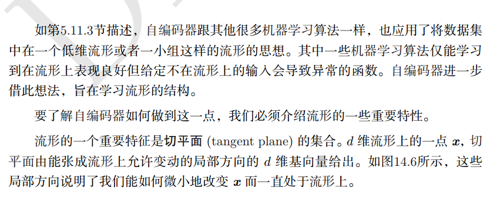
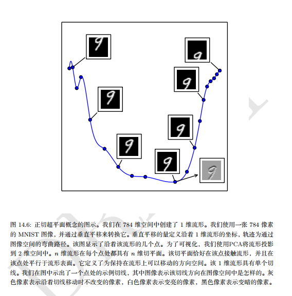
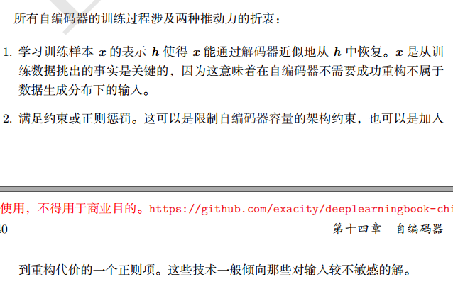
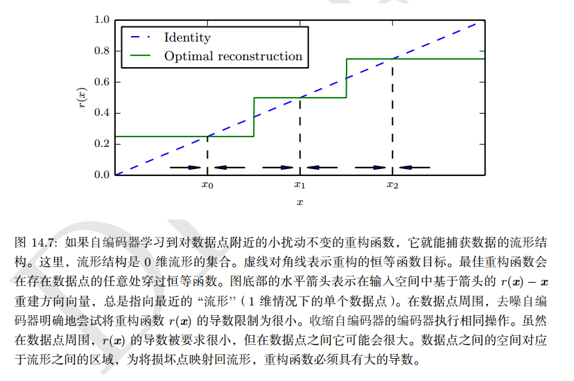

### What to do when data is missing?

* 数据中有些数据缺失
* 三种情况：
    * MCAR： 数据缺失完全随机
    * MAR： 数据缺失随机
    * MNAR： 数据缺失不随机
* 三种处理方法：
    * 剔除
    * 使用均值补上
    * 训练一个回归模型，预测那些值
* 训练一个mask自编码预测缺失数据。

### 栈式自编码

* 逐层贪婪训练法依次训练网络的每一层，进而预训练整个深度神经网络。
可以将自编码器“栈化”到逐层贪婪训练法中，从而预训练（或者说初始化）深度神经网络的权重。
* 栈式自编码神经网络是一个由多层稀疏自编码器组成的神经网络，其前一层自编码器的输出作为其后一层自编码器的输入。

* 栈式自编码神经网络具有强大的表达能力及深度神经网络的所有优点。
* 它通常能够获取到输入的“层次型分组”或者“部分-整体分解”结构。
* 栈式自编码神经网络的第一层会学习得到原始输入的一阶特征（比如图片里的边缘），
第二层会学习得到二阶特征，该特征对应一阶特征里包含的一些模式（比如在构成轮廓或者角点时，什么样的边缘会共现）。
栈式自编码神经网络的更高层还会学到更高阶的特征。

* [paper](paper/2007-Greedy%20Layer-Wise%20Training%20of%20Deep%20Networks.pdf)
* 这种预训练方式，可以作为初始化，尤其是当有大量没有标签的数据的时候。

###

### 表示能力、层的大小和深度

* 深度自编码器（编码器至少包含一层额外隐藏层）在给定足够多的隐藏单元的情况下，能以任意精度近似任何从输入到编码的映射。
* 深度可以指数地降低表示某些函数的计算成本。
* 深度也能指数地减少学习一些函数所需的训练数据量。实验中，深度自编码器能比相应的浅层或线性自编码器产生更好的压缩效率。
* 训练深度自编码器的普遍策略是训练一堆浅层的自编码器来贪心地预训练相应的深度架构。所以即使最终目标是训练深度自编码器，我们也经常会遇到浅层自编码器。

* 万能近似定理保证至少有一层隐藏层且隐藏单元足够多的前馈神经网络能以任意精度近似任意函数（在很大范围里），
这是非平凡深度（至少有一层隐藏层）的一个主要优点。这意味着具有单隐藏层的自编码器在数据域内能表示任意近似数据的恒等函数。
但是，从输入到编码的映射是浅层的。这意味这我们不能任意添加约束，比如约束编码稀疏。
* 每次当网络快要拟合数据的时候， 网络学习的进步最大，那么是不是残差网络就是最好的，总是达到最好的拟合。

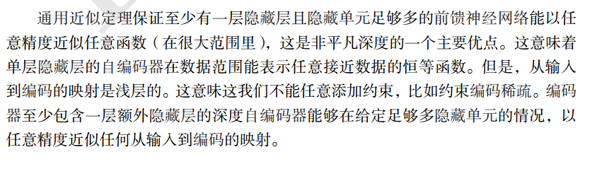

#### batch_size 对网络的影响

* 越大越好
* 影响不大， 尤其是网络欠你和的时候, 当网络过拟合的时候影响变大

#### learning 对网络的影响

* 小一点学习起来慢，但是学习效果好
* 减小学习率然后训练更多代数，效果很好

#### epoch 对网络的影响

* 当网络可以拟合的时候影响不是很大
* 但是对于训练数据还没有达到拟合的时候影响还是非常大的

## Unpooling

* 池化过程实际上就是降维过程，假设图片大小为32x32，池化大小为2x2，
就相当于将图片中相邻的2x2个像素点替换为四个点中最大数值（max-pooling），
池化处理之后得到的图片大小为16x16，Unpooling过程则需要将16x16的图片变为32x32，
其实在池化过程中，会标记2x2像素点中最大值的位置，在Unpooling过程将最大值还原，其他位置填0

## Deconvolution

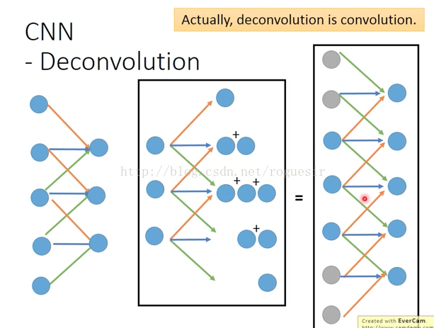
* 卷积过程是一个矩阵在另一个矩阵上面做滑动运算，反卷积也是一样，实际上，反卷积就是卷积，看下面的图，
我们熟悉的是左面的卷积过程，假设有5个像素点，卷积核为3，步长为1，卷积之后生成3个feature，
我们想象中的反卷积应该是中间所示的情形，由3个输入生成5个输出，如果我们将反卷积中的输入做2的padding，
这样原本3个输入变成7个输入，再做卷积，生成5个输出，对比左右两侧的图，是完全相反的，所以，我们加上padding，使反卷积变成了卷积运算。

## 问题

### 如何定义两张图像的距离

* 欧式距离