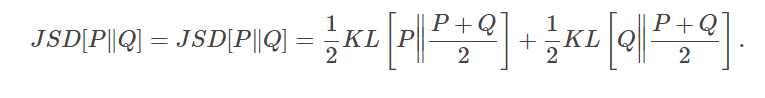
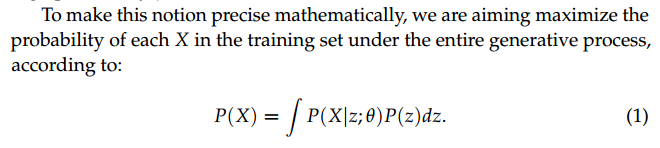
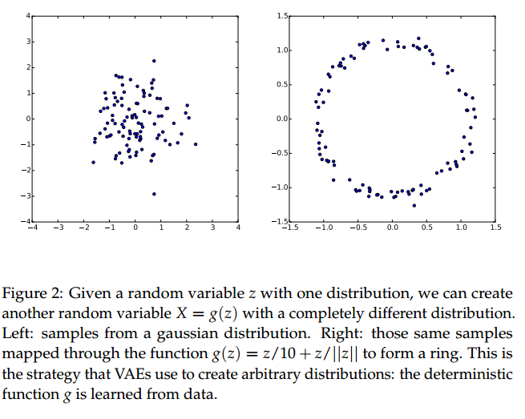
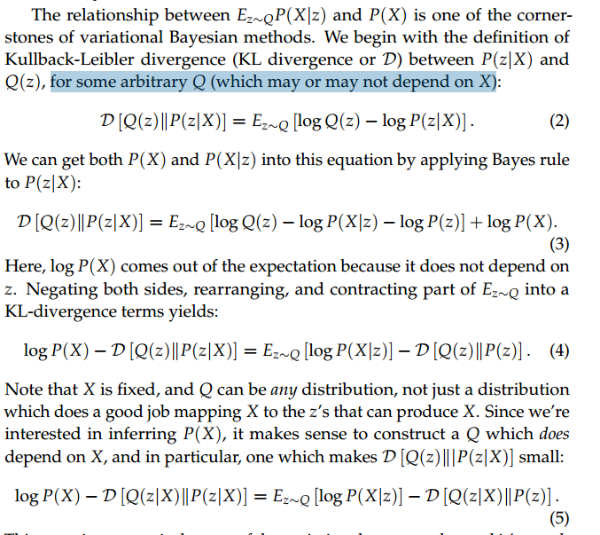
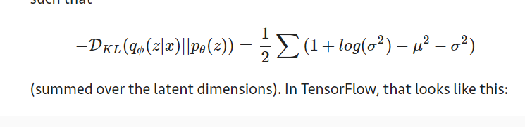
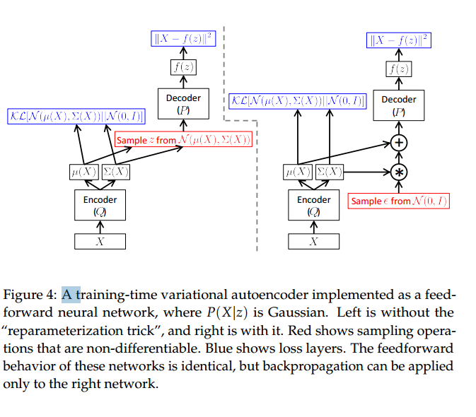
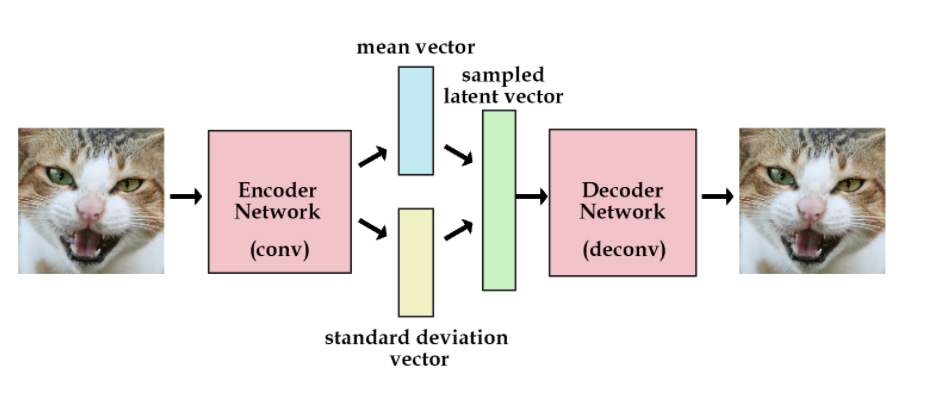

# 变分自编码


## what

* [paper](paper/Auto-Encoding%20Variational%20Bayes.pdf)
* [paper第上面文章的解读](paper/2016-Tutorial%20on%20Variational%20Autoencoders.pdf)

* 约束隐变量，使它满足单位高斯分布。
* 一个描述神经网络的常见方法是近似一些我们想建模的函数。然而神经网络也可以被看做是携带信息的数据结构
* [VAE（1）——从KL说起](https://zhuanlan.zhihu.com/p/22464760)
* [VAE(2)——基本思想](https://zhuanlan.zhihu.com/p/22464764)
* [VAE(3)——公式与实现](https://zhuanlan.zhihu.com/p/22464768)
* [Variational Autoencoders Explained](http://kvfrans.com/variational-autoencoders-explained/)

* 缺点：
    * VAE的缺点是它使用直接均方误差而不是对抗网络，所以网络往往会产生更多模糊的图像。


## why

* 随机选择隐变量不是好主意， 在自编码中, 我们加入一个组件输入为原始图片，输出为编码向量. 反卷积再讲编码向量解码到原始图片。
* 我们尝试建立生成模型，而不是只能记忆图片结构, 我们需要知道如何建立隐变量向量，而不是从原始图片编码它们。
* 简单方案，我们直接给编码网络添加约束。 强制它生成严格遵循单位高斯分布隐变量,
正是这种约束将变分自动编码器和标准自动编码器分开。
* 产生新的图片现在很容易：我们需要采样一个隐变量向量从单位高斯分布并把它传给解码器。
* 变分自动编码器（VAE）将无监督深度学习和变分贝叶斯方法巧妙地整合到一个时尚的软件包中。
* AVE可以学习到很好的流形（低维表示），并且生成质量良好的原始图片。


## how

* 直接给编码网络添加约束。 强制它生成严格遵循单位高斯分布隐变量。
* 产生新的图片现在很容易：我们需要采样一个隐变量向量从单位高斯分布并把它传给解码器。


## where


### 生成对抗的方式学习 两个概率分布差距

* 生成对抗网络（GANs）与敌对判别模型联合训练生成模型，试图区分人造数据和真实数据。 
这个想法是，一个生成模型是好的，如果它可以欺骗最好的区分模型，使其认为生成的样本是真实的。
 GAN制作了一些你可以在互联网上找到的最好看的样本，并让人们再次对生成模型感到兴奋。



# 论文阅读

* [Tutorial on Variational Autoencoders](paper/2016-Tutorial%20on%20Variational%20Autoencoders.pdf)


### 摘要

* VAE利用神经网络建立，并可以通过随机梯度下降训练。
* VAE可以生成很多种类的数据.
* 本文介绍AVE背后的数学，描述实验表现。


###  1 Introduction   

* “生成建模”是机器学习的一个广泛领域，它涉及在一些潜在的高维空间X中定义在数据点X上的分布P（X）的模型。例如生成图片。
* 如果我们能够到数据的分布，我们就可以造成更多的数据。
    * 之前的方法都需要假设数据的分布，这是个大问题
    * AVE解决这个问题

#### 1.1 Preliminaries: Latent Variable Models

* 在训练生成模型时，维度之间的依赖关系越复杂，模型越难训练。
* 在我们的模型绘制任何东西之前，它首先从集合`[0，...，9]`中随机抽样一个数字值z，然后确保所有笔划都匹配那个字符。 
z被称为'潜在'，因为只给出模型产生的字符，我们不一定知道潜在变量的哪些设置产生了字符。我们需要用像计算机视觉这样的东西来推断它。
* 当我们的模型为每个数据找到了潜变量的时候，我们的模型就学好了。 z（学到的分布） * θ（学到的参数） = x（数据集）



### 2 Variational Autoencoders




#### AVE需要处理两个问题

* 隐变量z如何表示？
    * 使用标准正态分布，因为只要有一个n维标准正态分布的z，再找到一个足够复杂的函数g，那么g(z)就可以表示任意一个n维分布。
    * 他们假设对z的维度没有简单的表达，而是断言z的样本可以从简单的分布中得出，即N（0，I），其中I是单位矩阵。
    * 我们希望避免手工决定z的每个维度编码的信息、
    * 通过足够复杂的函数，d为的两个任意分布之间可以转换。

* 以及如何处理z上的积分


### 2.1 Setting up the objective 设定目标

* 这意味着我们需要一个新的函数Q（z | X），它可以取X的值，并给出一个可能产生X的z值的分布。
* 希望在Q下可能的z值的空间将比在先前的P（z）下可能的所有z的空间小得多。 这让我们比较容易计算Ez〜QP（X | z）。 

* 这里KL散度使用的公式：


* Q : 将x编码为z； P： 用z重构x

#### 2.2 Optimizing the objective 优化目标

* Q(z|X) = N(z|µ(X; ϑ), Σ(X; ϑ)), θ可以从数据集学习。


* L2 norm or mse 作为重构损失是因为假设了似然分布是 normal. 
log概率 c*exp(k*(x-x*)^2) (高斯) x是重构，x*是标签. log 似然 c + k(x-x*)^2 ~ (x-x*)^2 这就是MSE损失的由来.
如果我们假设x是 Bernoulli distribution这样就获得解码损失为交叉熵。

* [Introducing Variational Autoencoders (in Prose and Code)](http://blog.fastforwardlabs.com/2016/08/12/introducing-variational-autoencoders-in-prose-and.html)

* [Under the Hood of the Variational Autoencoder](http://blog.fastforwardlabs.com/2016/08/22/under-the-hood-of-the-variational-autoencoder-in.html)
    * 变分自编码采用KL散度的方式，使得分布近似正太分布，使用KL散度度量两个分布。
    * 因为KL散度不对称 — DKL(q||p)≠DKL(p||q)— 所以对于生成模型， 它不是一个正确的度量。


* [How to Train your Generative Models? And why does Adversarial Training work so well?](http://www.inference.vc/how-to-train-your-generative-models-why-generative-adversarial-networks-work-so-well-2/)
    * 当目标是训练一个能够生成自然样本的模型时，极大似然不是一个理想的训练目标。 极大似然是一致的，−Ex∼QlogP(x)
    所以如果给出无限数据和完美模型类，它可以学习任何分布。 然而，在模型错误指定和有限数据下，它都倾向于生成过度概括的模型。
    * KL[P∥Q]可以度量两个分布差距。
    * KL散度是度量用一个分布来近似另一个分布时的信息损失量，不能度量距离。
    因为KL散度不对称 — KL(q||p)≠KL(p||q)— 而距离度量是对称的。
    * 极大似然和 KL[Q∥P] 差别
        * 极大似然和最小化 KL[P∥Q] 是一样的
        * 处理无穷数据的时候是一样的
        * 处理有限数据方式不一样
            * KL[P∥Q]  趋向于Q过度生成p. 如果p是多模型, 优化Q将趋向于覆盖所有p的模型，即使当p=0的时候损失很大。
             实际上，这意味着模型偶尔会采样看起来不像P样本的不合理样本。
            * KL [Q || P]倾向于低于泛化。 最优Q将典型地描述P的单一最大模式，
            如果它们在不覆盖低概率区域的情况下难以建模，代价是忽略其他模式。
            实际上，这意味着KL [Q || P]将尝试避免引入不合理的样本，有时会以P的大部分可疑样本丢失为代价。
        * KL[P∥Q] 自由的, KL[Q∥P]  保守的. 
        * 当然问题在于KL [Q || P]超出了P的有限样本难以优化的程度。甚至比最大似然更难。 
        不仅如此，KL散度的表现也不是很好，而且没有明确定义，除非P在Q为正的任何地方都是正值。 
        所以我们没有希望把KL [Q || P]变成一个实用的训练算法
    * KL[Q || P]是很难优化的，当训练样本的有限的时候,而且除非任何Q为正的地方P也为正的。负责表现不是很好。


    
        
* loss定义
```
# 重构loss： 网络重构图片的能力
generation_loss = mean(square(generated_image - real_image))  
# a latent loss： KL散度度量下隐变量和单位高斯分布的接近程度
latent_loss = KL-Divergence(latent_variable, unit_gaussian)  
# 两个损失的折中
loss = generation_loss + latent_loss 
```
* 计算KL散度技巧：  为了优化KL散度, 代替编码生成实值向量，它将生成 means 向量和 standard deviations 向量。


> 思路是, 从 N（u, sd）采样和从 N(0, 1)采用数据 然后 (data * sd + u)运算得到数据是一样的。
现在编码器的重构损失和KL散度可以一起训练,重构损失将约束编码器输出单位高斯值。
* 采样操作对和不可导， 无法使用反向传播。
* 所以最终，VAE的优化目标就是，让最终的输出与目标足够接近的同时，隐变量的分布接近真实先验分布。


## 实验

### 使用交叉熵定义重构损失
* 隐变量个数
    * 20： 正常训练
    * 2： nan两个损失都走向了nan
    
### 使用 MSE 作为重构损失
* 隐变量个数： 
    * 2：能够学到东西，损失很大，
    * 20：


## 问题

### 为什么KL散度就成了 N(0, 1)


